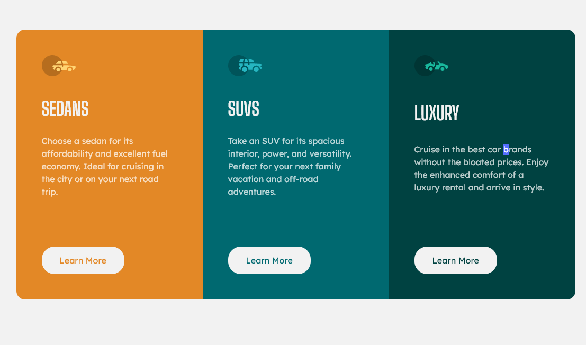

- Превью: https://kseylo.github.io/3-column-preview-card-component/
## Установка:

Установка node_modules
```
pnpm install
```

Запуск
```
pnpm dev
```


## Скриншоты:

### ПК:


### Телефон:


## Технологии которые использовал:
- HTML
- CSS

## Проблемы с которыми столкнулся:

- Подзабыл как использовать media-queries

Решение:
```css
/* Для телефонов */
@media screen and (max-width: 70em) {
	/* какой-то код */
}

/* Для пк */
@media screen and (min-width: 70em) {
	/* какой-то код */
}
```
